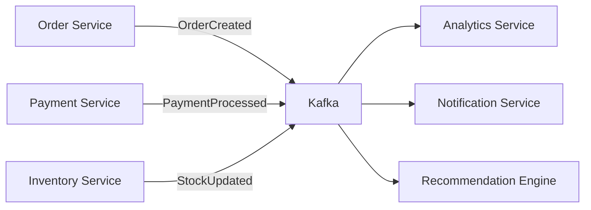

# Apache Kafka: An Introduction to Event-Driven Architecture

## 🧭 Introduction

Apache Kafka is a distributed event streaming platform that was originally developed at LinkedIn in 2011 to handle their massive real-time data pipeline needs. It's designed to be fast, scalable, and fault-tolerant — capable of handling millions of messages per second across thousands of topics.

### Why Kafka Matters

Traditional request-response architectures struggle with modern demands:
- **High throughput**: Microservices generating thousands of events per second
- **Real-time processing**: Need for immediate data availability across systems
- **Decoupled systems**: Services that shouldn't directly depend on each other
- **Data durability**: Ensuring no events are lost during system failures

Kafka solves these challenges by providing a distributed commit log that acts as a central nervous system for your architecture.

## ⚙️ How Kafka Works

### Core Concepts

**Topics**: Named channels where messages are published. Think of them as categories or feeds (e.g., `user-events`, `order-updates`, `system-logs`).

**Producers**: Applications that publish messages to topics. They don't send messages directly to consumers — they just write to topics.

**Consumers**: Applications that read messages from topics. Multiple consumers can read from the same topic (fan-out), or multiple consumers can work together to process messages (consumer groups).

**Brokers**: Kafka servers that store the data. A cluster typically has multiple brokers for fault tolerance.

**Partitions**: Topics are divided into partitions for parallel processing. Each partition is an ordered, immutable sequence of records.

### Message Retention & Durability

Kafka's superpower is its retention model:
- Messages are stored on disk and replicated across brokers
- Retention is time-based (e.g., keep messages for 7 days) or size-based
- Once written, messages are immutable and can be replayed
- Consumers control their own position (offset) in the stream

### Kafka vs Traditional Message Queues

| Aspect | Kafka | RabbitMQ/ActiveMQ |
|--------|-------|-------------------|
| **Retention** | Configurable, persistent | Usually deleted after consumption |
| **Replay** | Yes, consumers control offset | No, messages are gone |
| **Throughput** | Millions of messages/sec | Thousands of messages/sec |
| **Ordering** | Per partition | Per queue |
| **Use Case** | Event streaming, analytics | Task queues, RPC |

## 🛠️ Use Cases and When to Use Kafka

### Event Sourcing
Store all changes to application state as a sequence of events. This enables:
- Complete audit trail
- Temporal queries ("what was the state at time X?")
- Easy debugging and replay capabilities

### Real-time Analytics
Process data streams for immediate insights:
- User behavior tracking
- Fraud detection
- Real-time dashboards
- A/B testing results

### Microservices Communication
Decouple services through events:
- Order service publishes `OrderCreated` event
- Inventory service, notification service, analytics service all consume independently
- No direct dependencies between services

### Log Aggregation
Centralized logging across distributed systems:
- Application logs from all services
- System metrics and monitoring data
- Security events and audit trails

## 💼 Real-world Examples

### E-commerce Microservices Architecture



**Flow**: When a customer places an order:
1. Order Service creates order and publishes `OrderCreated` event
2. Payment Service processes payment and publishes `PaymentProcessed`
3. Inventory Service updates stock and publishes `StockUpdated`
4. Multiple downstream services consume these events independently

### Observability Pipeline

```bash
# Application logs → Kafka → Processing → Storage
app.logs → kafka://logs-topic → log-processor → elasticsearch
system.metrics → kafka://metrics-topic → metrics-aggregator → prometheus
user.events → kafka://events-topic → analytics-engine → data-warehouse
```

## 💡 Developer Benefits

### Loose Coupling
Services communicate through events without knowing about each other:
- Add new consumers without modifying producers
- Remove services without breaking others
- Independent deployment and scaling

### Scalability
- Horizontal scaling: Add more brokers and partitions
- Consumer scaling: Multiple instances in consumer groups
- Producer scaling: Multiple producers can write to same topic

### Asynchronous Communication
- Non-blocking operations
- Better fault tolerance
- Improved system responsiveness

## ⚖️ When NOT to Use Kafka

### Avoid Kafka for:
- **Simple request-response patterns**: Use HTTP APIs or gRPC
- **Small-scale applications**: Overkill for simple CRUD apps
- **Temporary data**: If you don't need message retention
- **Complex routing**: Kafka has limited message routing capabilities
- **Low-latency requirements**: Kafka adds ~1-10ms latency

### Architectural Trade-offs
- **Complexity**: Requires understanding of distributed systems
- **Operational overhead**: Need to manage brokers, Zookeeper, monitoring
- **Learning curve**: Different paradigm from traditional messaging
- **Resource usage**: More memory and disk space than simple queues

## 🧠 Kafka vs Alternatives

### Kafka vs AWS Kinesis
- **Kafka**: Self-hosted, more control, higher throughput
- **Kinesis**: Managed service, easier operations, AWS integration

### Kafka vs Redis Streams
- **Kafka**: Distributed, persistent, high throughput
- **Redis Streams**: In-memory, faster, simpler setup

### Kafka vs RabbitMQ
- **Kafka**: Event streaming, replay capability, high throughput
- **RabbitMQ**: Message queuing, complex routing, lower latency

## 📚 Further Learning

- **Official Documentation**: [kafka.apache.org](https://kafka.apache.org/documentation/)
- **Confluent Platform**: Enterprise distribution with additional tools
- **Kafka Streams**: Stream processing library built on Kafka
- **KSQL**: SQL-like stream processing for Kafka

---

*Kafka transforms your architecture from a tightly-coupled request-response system into a loosely-coupled event-driven ecosystem. It's not just a messaging system — it's the foundation for building scalable, resilient, and real-time applications.*
