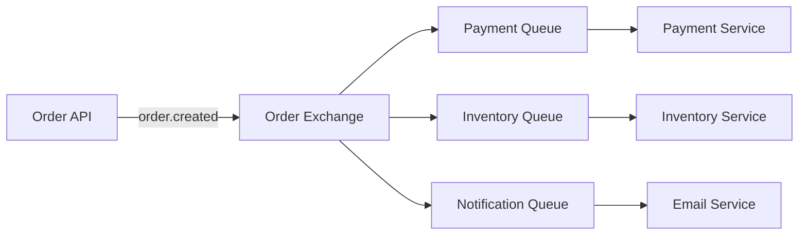

# RabbitMQ: The Message Broker That Keeps Your Microservices Talking

## 🧭 Introduction

RabbitMQ is like the postal service of your distributed system—it ensures messages get delivered to the right place, at the right time, even when things go wrong. Originally developed by Rabbit Technologies in 2007, it's become the go-to message broker for developers who need reliable, flexible messaging between services.

### Why RabbitMQ Matters

In the world of microservices, direct HTTP calls between services create a web of dependencies that's hard to maintain and scale. When Service A needs to notify Service B about a user registration, and Service C needs to send a welcome email, and Service D needs to update analytics—suddenly Service A is responsible for knowing about and calling three other services.

RabbitMQ solves this by introducing a message broker that decouples producers from consumers. Service A just publishes a "UserRegistered" message and goes about its business. RabbitMQ handles the routing, queuing, and delivery to all interested consumers.

## ⚙️ How RabbitMQ Works

### Core Concepts

**Producer**: The application that sends messages. It doesn't know or care who will receive them.

**Consumer**: The application that receives messages. It subscribes to queues and processes messages as they arrive.

**Queue**: A buffer that stores messages until they're consumed. Think of it as a mailbox where messages wait for pickup.

**Exchange**: The routing mechanism that receives messages from producers and routes them to queues based on rules.

**Binding**: The relationship between an exchange and a queue, defined by routing keys or patterns.

### The Message Flow

```
Producer → Exchange → Queue → Consumer
```

1. **Producer** sends a message to an **Exchange** with a routing key
2. **Exchange** uses routing rules to determine which **Queues** should receive the message
3. **Queue** stores the message until a **Consumer** is ready to process it
4. **Consumer** acknowledges the message, removing it from the queue

### Exchange Types: Choosing Your Routing Strategy

**Direct Exchange**: Routes messages based on exact routing key matches
```javascript
// Producer
channel.publish('user-events', 'user.registered', Buffer.from(message));

// Consumer
channel.bindQueue('email-queue', 'user-events', 'user.registered');
```

**Topic Exchange**: Routes messages based on wildcard patterns
```javascript
// Producer
channel.publish('notifications', 'user.profile.updated', Buffer.from(message));

// Consumer - matches user.*.updated
channel.bindQueue('notification-queue', 'notifications', 'user.#.updated');
```

**Fanout Exchange**: Broadcasts messages to all bound queues (no routing key needed)
```javascript
// Producer
channel.publish('system-events', '', Buffer.from(message));

// All bound queues receive the message
channel.bindQueue('logging-queue', 'system-events', '');
channel.bindQueue('monitoring-queue', 'system-events', '');
```

**Headers Exchange**: Routes based on message headers instead of routing keys
```javascript
// Producer
channel.publish('events', '', Buffer.from(message), {
  headers: { priority: 'high', region: 'us-east' }
});

// Consumer
channel.bindQueue('priority-queue', 'events', '', {
  'x-match': 'all',
  priority: 'high',
  region: 'us-east'
});
```

## 🛠️ Use Cases and When to Use RabbitMQ

### Asynchronous Task Processing

Perfect for offloading time-consuming operations:

```javascript
// Web API receives order
app.post('/orders', async (req, res) => {
  const order = await createOrder(req.body);
  
  // Send to queue for background processing
  await channel.publish('orders', 'order.created', 
    Buffer.from(JSON.stringify(order)));
  
  res.json({ orderId: order.id, status: 'processing' });
});

// Background worker processes order
channel.consume('order-processing-queue', async (msg) => {
  const order = JSON.parse(msg.content.toString());
  
  // Time-consuming operations
  await processPayment(order);
  await updateInventory(order);
  await sendConfirmationEmail(order);
  
  channel.ack(msg);
});
```

### Service Decoupling

Break tight dependencies between microservices:

```javascript
// User Service - doesn't know about other services
class UserService {
  async registerUser(userData) {
    const user = await this.createUser(userData);
    
    // Publish event, don't call other services directly
    await this.eventBus.publish('user.registered', {
      userId: user.id,
      email: user.email,
      timestamp: new Date()
    });
    
    return user;
  }
}

// Email Service - subscribes independently
class EmailService {
  async start() {
    await this.channel.consume('email-queue', async (msg) => {
      const event = JSON.parse(msg.content.toString());
      await this.sendWelcomeEmail(event.email);
      this.channel.ack(msg);
    });
  }
}
```

### Load Balancing

Distribute work across multiple workers:

```javascript
// Multiple workers processing the same queue
// Worker 1
channel.consume('image-processing-queue', async (msg) => {
  await processImage(msg.content);
  channel.ack(msg);
});

// Worker 2 (same queue, different process)
channel.consume('image-processing-queue', async (msg) => {
  await processImage(msg.content);
  channel.ack(msg);
});
```

### Reliable Communication

Handle network failures and service restarts:

```javascript
// Producer with confirmation
await channel.confirmSelect();
await channel.publish('events', 'user.updated', Buffer.from(data));
await channel.waitForConfirms();

// Consumer with acknowledgment
channel.consume('user-events-queue', async (msg) => {
  try {
    await processUserUpdate(msg.content);
    channel.ack(msg); // Message processed successfully
  } catch (error) {
    channel.nack(msg, false, true); // Reject and requeue
  }
});
```

## 💼 Real-world Examples

### E-commerce Order Processing



**Flow**: When a customer places an order:
1. Order API creates the order and publishes `order.created` event
2. Payment Service processes payment asynchronously
3. Inventory Service reserves items
4. Email Service sends confirmation
5. All services work independently without blocking each other

### Microservices Event Bus

```javascript
// Event Bus implementation
class EventBus {
  constructor(connection) {
    this.connection = connection;
    this.channel = null;
  }

  async publish(eventType, data) {
    const channel = await this.getChannel();
    await channel.publish('events', eventType, 
      Buffer.from(JSON.stringify({
        type: eventType,
        data,
        timestamp: new Date().toISOString(),
        id: generateId()
      }))
    );
  }

  async subscribe(eventType, handler) {
    const channel = await this.getChannel();
    const queue = await channel.assertQueue('', { exclusive: true });
    
    await channel.bindQueue(queue.queue, 'events', eventType);
    
    channel.consume(queue.queue, async (msg) => {
      const event = JSON.parse(msg.content.toString());
      await handler(event);
      channel.ack(msg);
    });
  }
}
```

## 💡 Developer Benefits

### Loose Coupling
Services communicate through messages without direct dependencies:
- Add new consumers without modifying producers
- Remove services without breaking others
- Independent deployment and scaling

### Reliability
- Message persistence (survives broker restarts)
- Acknowledgment-based delivery
- Dead letter queues for failed messages
- Publisher confirms for guaranteed delivery

### Flexibility
- Multiple exchange types for different routing needs
- Message priorities and TTL
- Plugin system for extensions
- Support for multiple protocols (AMQP, MQTT, STOMP)

### Monitoring and Debugging
- Built-in management UI
- Message tracing and logging
- Performance metrics
- Queue depth monitoring

## ⚖️ When NOT to Use RabbitMQ

### Avoid RabbitMQ for:
- **Simple request-response**: Use HTTP APIs or gRPC
- **High-frequency, low-latency**: Consider Redis or in-memory queues
- **Large message sizes**: Messages are held in memory
- **Complex event streaming**: Consider Apache Kafka
- **Simple task queues**: Consider Celery or Bull

### Architectural Trade-offs
- **Complexity**: Requires understanding of messaging patterns
- **Operational overhead**: Need to manage broker, monitoring, scaling
- **Learning curve**: Different paradigm from synchronous communication
- **Resource usage**: More memory and CPU than simple HTTP calls

## 🧠 RabbitMQ vs Alternatives

### RabbitMQ vs Apache Kafka
- **RabbitMQ**: Message queuing, complex routing, lower latency
- **Kafka**: Event streaming, replay capability, higher throughput

### RabbitMQ vs Redis
- **RabbitMQ**: Advanced routing, persistence, reliability
- **Redis**: Simpler, faster, in-memory operations

### RabbitMQ vs AWS SQS
- **RabbitMQ**: Self-hosted, more control, complex routing
- **SQS**: Managed service, simpler operations, AWS integration

## 📚 Best Practices

### Message Design
```javascript
// Good: Structured, versioned messages
{
  "version": "1.0",
  "type": "user.registered",
  "id": "evt_123456",
  "timestamp": "2024-01-15T10:30:00Z",
  "data": {
    "userId": "user_789",
    "email": "user@example.com"
  },
  "metadata": {
    "source": "auth-service",
    "correlationId": "req_456"
  }
}
```

### Error Handling
```javascript
// Dead letter queue setup
await channel.assertQueue('main-queue', {
  arguments: {
    'x-dead-letter-exchange': 'dlx',
    'x-dead-letter-routing-key': 'failed'
  }
});

await channel.assertExchange('dlx', 'direct');
await channel.assertQueue('dead-letter-queue');
await channel.bindQueue('dead-letter-queue', 'dlx', 'failed');
```

### Performance Tuning
```javascript
// Prefetch for better throughput
await channel.prefetch(10); // Process 10 messages at once

// Batch acknowledgments
channel.consume('queue', async (msg) => {
  await processMessage(msg);
  // Acknowledge after processing
  channel.ack(msg);
});
```

## 🎯 Getting Started

1. **Install RabbitMQ**: `brew install rabbitmq` (macOS) or use Docker
2. **Start the server**: `rabbitmq-server`
3. **Access management UI**: http://localhost:15672 (guest/guest)
4. **Install client library**: `npm install amqplib`
5. **Write your first producer and consumer**

## 💡 Pro Tips

- **Use connection pooling**: Reuse connections, create channels per thread
- **Implement circuit breakers**: Handle broker failures gracefully
- **Monitor queue depths**: Set up alerts for growing queues
- **Use message TTL**: Prevent infinite message accumulation
- **Test with different exchange types**: Choose the right routing strategy for your use case

---

*RabbitMQ transforms your architecture from a tightly-coupled web of HTTP calls into a loosely-coupled message-driven system. It's not just a message broker—it's the foundation for building resilient, scalable, and maintainable distributed applications.* 